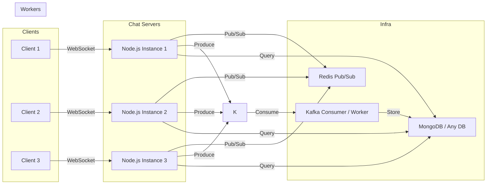

# Scalable Chat Application

This project is a **scalable real-time chat application** designed with modern web technologies.
It supports secure user authentication, live messaging, and robust data pipelines for handling large-scale usage.


## Architecture

This architecture uses multiple Node.js servers to handle WebSocket connections, with Redis Pub/Sub ensuring real-time events are synchronized across all instances. Messages are published to Kafka for scalable, durable processing, then consumed by workers that store them in MongoDB. This design separates concerns—real-time communication, message streaming, and data persistence—making the system highly scalable and fault-tolerant.



##  Tech Stack Overview

| Technology                                                                                     | Description                          | Role in Project                                                                       |
| ---------------------------------------------------------------------------------------------- | ------------------------------------ | ------------------------------------------------------------------------------------- |
| <div align="center"><br>React</div>              | Frontend library for building UIs    | Builds the user interface and handles client-side routing & rendering                 |
| <div align="center"><br>Vite</div>                 | Frontend build tool                  | Extremely fast dev server & bundler for React                                         |
| <div align="center"><br>Tailwind CSS</div> | Utility-first CSS framework          | Styles the app responsively and cleanly, with DaisyUI components                      |
| <div align="center"><br>JavaScript</div>       | Programming language                 | Core language used across frontend (React) and backend (Node.js)                      |
| <div align="center"><br>Node.js</div>         | JavaScript runtime                   | Runs the Express backend server for APIs and Socket.io                                |
| <div align="center"><br>Express</div>        | Node.js web framework                | Handles HTTP requests, user auth, routing, and initializes Socket.io                  |
| <div align="center"><br>Socket.io</div>                                                      | Real-time WebSocket library          | Enables bi-directional communication for live chat, uses Redis adapter to scale       |
| <div align="center"><br>MongoDB</div>        | NoSQL database                       | Stores users, chat history, and other app data                                        |
| <div align="center"><br>Kafka</div>              | Distributed event streaming platform | Handles message brokering; ensures messages are decoupled & can be processed reliably |
| <div align="center"><br>Redis</div>              | In-memory data store                 | Enables Socket.io pub/sub for scaling across servers                                  |
| <div align="center"><br>Docker</div>           | Container platform                   | Runs Kafka, Zookeeper, and Redis services for consistent local dev & deployment       |
| <div align="center"><br>pnpm</div>                 | Fast JS package manager              | Installs project dependencies quickly and efficiently                                 |
| <div align="center"><br>Postman</div>        | API testing tool                     | Tests REST APIs during development                                                    |
| <div align="center"><br>Git</div>                    | Version control                      | Tracks code changes in the project                                                    |
| <div align="center"><br>GitHub</div>           | Code hosting platform                | Hosts repository for collaboration, CI/CD, and backups                                |

## DevOps & Observability Stack

(Yet to be added...)

| Technology                                                                                         | Description                 | Role in Project                                                              |
| -------------------------------------------------------------------------------------------------- | --------------------------- | ---------------------------------------------------------------------------- |
| <div align="center"><br>Jenkins</div>            | Automation server           | CI/CD pipeline to build, test, and deploy the application                    |
| <div align="center"><br>Docker</div> | Image registry              | Stores built container images for consistent deployments
| <div align="center"><br>Prometheus</div> | Metrics monitoring system | Collects and stores time-series data, powering Grafana dashboards for system metrics |
| <div align="center"><br>Grafana</div>            | Visualization tool          | Dashboards for monitoring metrics & logs                                     |
| <div align="center"><br>Sentry</div>               | Error tracking & monitoring | Captures exceptions, frontend & backend errors, with alerts and stack traces |
| <div align="center"><br>Trivy</div>                                                             | Security scanner            | Scans Docker images for vulnerabilities before pushing to prod               |

## Express Routers

This folder contains the route definitions for the authentication and messaging modules of the application. Each router modularizes related endpoints and applies the necessary middleware.

### `auth.route.js` (mounted at `/api/auth`)

Handles user authentication and profile management.

| Method | Route             | Description                                              |
| ------ | ----------------- | -------------------------------------------------------- |
| POST   | `/login`          | Logs in a user and returns a JWT token                   |
| POST   | `/signup`         | Registers a new user with validated input                |
| POST   | `/logout`         | Logs out the user, clears auth token cookie              |
| POST   | `/update-profile` | Updates user profile data *(protected)*                  |
| GET    | `/get-user`       | Fetches currently logged-in user's profile *(protected)* |
| GET    | `/check-auth`     | Checks if the user is authenticated *(protected)*        |

### `message.route.js` (mounted at `/api/messages`)

Manages messaging functionality between users.

| Method | Route       | Description                                                                 |
| ------ | ----------- | --------------------------------------------------------------------------- |
| GET    | `/users`    | Retrieves list of online users excluding the current user *(protected)*     |
| GET    | `/:id`      | Fetches all messages between the authenticated user and `:id` *(protected)* |
| POST   | `/send/:id` | Sends a message from authenticated user to user with `:id` *(protected)*    |

> [!NOTE] Protected routes use `authMiddleware` to ensure the user is logged in.


# Scaling

## Why scale?

As your chat app grows, handling many concurrent users becomes critical.
A single Node.js process can’t manage all connections efficiently.
We use distributed patterns to handle **millions of messages & connections**.

## Strategies used here

### 1. Socket.IO with Redis Adapter

When you run multiple instances of your server (e.g. behind Nginx or a Kubernetes Service), each Node.js process handles its own Socket.IO connections.
**Problem:** They don’t know about sockets connected to other processes.
**Solution:** Use the [socket.io-redis](https://socket.io/docs/v4/scaling-using-redis/) adapter to broadcast events across instances.

#### Example usage

```javascript
import { createServer } from "http";
import { Server } from "socket.io";
import { createAdapter } from "@socket.io/redis-adapter";
import { createClient } from "redis";

const httpServer = createServer();
const io = new Server(httpServer);

const pubClient = createClient({ url: "redis://localhost:6379" });
const subClient = pubClient.duplicate();

await pubClient.connect();
await subClient.connect();

io.adapter(createAdapter(pubClient, subClient));

io.on("connection", (socket) => {
  console.log("User connected", socket.id);
});

httpServer.listen(3000);
```

### 2. Kafka for message scaling

Use Kafka to decouple message delivery. Producers write messages to a topic.
Consumers (chat servers or workers) consume from it and process/store.

This handles **massive scale**, provides **message durability**, and decouples chat services from storage.

#### Example producer snippet

```javascript
import { Kafka } from "kafkajs";

const kafka = new Kafka({ brokers: ["localhost:9092"] });
const producer = kafka.producer();

await producer.connect();
await producer.send({
  topic: "chat-messages",
  messages: [{ key: "user1", value: "Hello there!" }],
});
```


## Installation

```bash
> git clone https://github.com/Atharvkote/Scalable-Chat-Application.git
> cd Scalable-Chat-Application
> npm install
> npm install --prefix client && npm install --prefix server
```

### Running the Server

```bash
> npm run dev  # Start of Both the Servers
                       [OR]
> npm run client # Start Client Server
> npm run server # Start Backend Server
```

### Client `.env`

```js
VITE_API_URL = http://localhost:5000/api
```

### Server `.env`

```js
NODE_ENV = development | production
SERVER_PORT = 5000
MONGODB_URI = <YOUR_MONGOURI>
SALT_ROUNDS = 10
JWT_SECRET = <your_jwt_secret_key>
JWT_EXPIRATION = 7d
REDIS_URL = <YOUR_REDIS_SERVER_URL>
REDIS_PORT = 6379
CLOUNDINARY_CLOUD_NAME = <CLOUND_NAME>
CLOUNDINARY_API_KEY = <YOUR_API_KEY>
CLOUNDINARY_API_SECRET = <YOUR_SECRET>
KAFKA_USERNAME = admin
KAFKA_PASSWORD = admin-secret
KAFKA_TOPIC = <TOPIC_NAME>
USER_IP = <YOUR_IP>
```

## Resources

* 📖 [Socket.IO Scaling using Redis Adapter](https://socket.io/docs/v4/scaling-using-redis/)
* 📖 [KafkaJS Documentation](https://kafka.js.org/docs/getting-started)
* 📖 [Docker Docs: Build and run images](https://docs.docker.com/get-started/)
* 📖 [Redis Docs](https://redis.io/docs/)
* 📖 [Kubernetes Docs](https://kubernetes.io/docs/home/)
